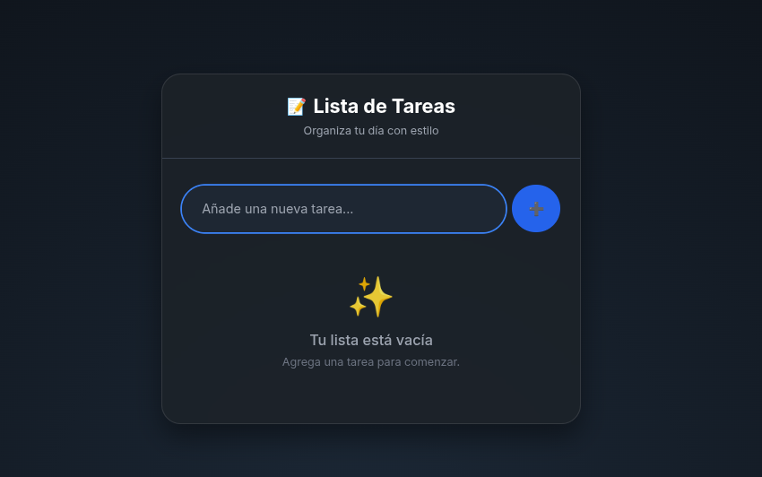

# ✅ Lista de Tareas con React

  
  
  


Aplicación web de **Lista de Tareas** desarrollada con **React + Vite**, creada como parte de un **proyecto de aprendizaje**.  

Su objetivo es reforzar conceptos clave del desarrollo frontend moderno, aplicando buenas prácticas y organización de proyectos.

---

## 🚀 Características

- 📦 Creación del proyecto con Vite para un entorno rápido y moderno.
- ⚛️ Uso de componentes reutilizables para mayor modularidad.
- 🔄 Manejo de estado con useState y eventos para la interacción.
- 🧩 Implementación de props para comunicación entre componentes.
- 📝 Registro de tareas con renderizado condicional.
- 📑 Listado dinámico de tareas con .map() y keys únicas.
- 📤 Lifting State Up para centralizar el control del estado en el componente principal.
- 🛠️ Creación de un hook personalizado (useTareas) para reutilizar lógica.
- 💾 Persistencia de datos en localStorage con useEffect.

---

## 📚 Conceptos de React aplicados

| Concepto            | Uso en el proyecto                           |
| ------------------- | -------------------------------------------- |
| **Componentes**     | `App`, `NuevaTarea`, `ListaTareas`, `Tarea` |
| **JSX**             | En todos los componentes                     |
| **Props**           | `NuevaTarea`, `ListaTareas`, `Tarea`        |
| **useState**        | `NuevaTarea`, `useTareas`                   |
| **Eventos**         | `onClick`, `onChange`, `onSubmit`           |
| **useEffect**       | Guardado en `localStorage`                  |
| **Renderizado cond.** | `if (tareas.length === 0)`                |
| **Listas y keys**   | `tareas.map` con `key={tarea.id}`           |
| **Lifting State Up**| `App` maneja el estado global de tareas     |
| **Hook personalizado** | `useTareas()`                            |

---

## 🛠️ Instalación y ejecución

```bash
# Clonar el repositorio
git clone https://github.com/emontenegrop/lista-tareas.git

# Entrar al proyecto
cd lista-tareas

# Instalar dependencias
npm install

# Ejecutar servidor de desarrollo
npm run dev

# Ejecutar el servidor con docker
docker compose -f docker-compose-dev.yaml up --build -d
```
# ingresar 
http://localhost:5173/


# Pantalla del sistema


